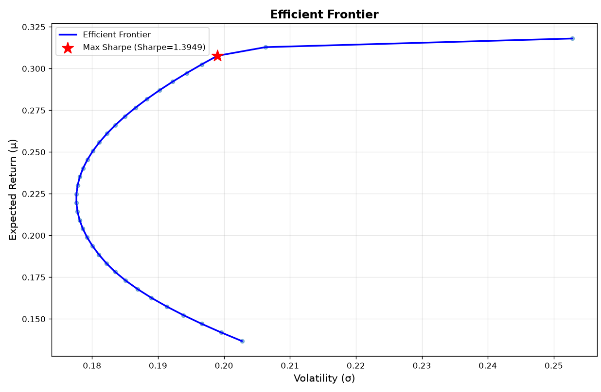
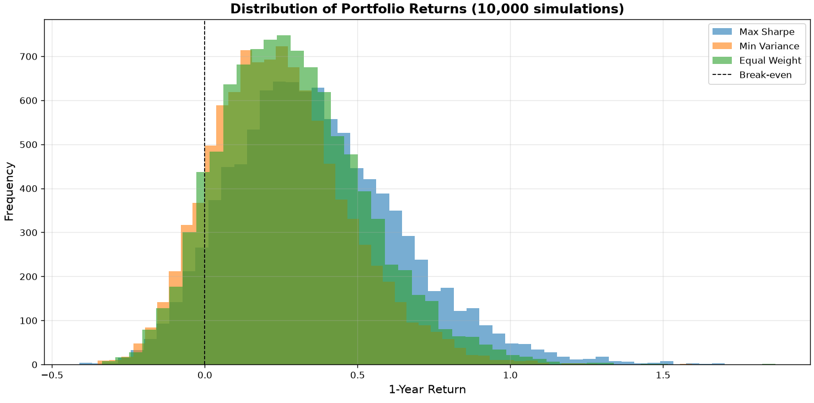

# Portfolio-optimization-beginner-
A structured, educational mini-project that builds a complete portfolio analysis system from first principles. Learn modern portfolio theory while writing production-quality code.

## 📊 Overview
This project implements **4 progressive levels** of portfolio optimization:

| Level | Focus | Key Concepts | Output |
|-------|-------|--------------|--------|
| **1** | Risk & Return Calculator | Log returns, covariance, portfolio metrics | Portfolio return, volatility, Sharpe ratio |
| **2** | Optimization | SLSQP algorithm, max Sharpe portfolio | Optimal weights, tangency portfolio |
| **3** | Robustness | Efficient Frontier, Ledoit-Wolf shrinkage | Smooth frontier, stable covariance |
| **4** | Tail Risk | Monte Carlo simulation, VaR, CVaR | Stress testing, downside protection metrics |

---

## 🎯 Key Features

✅ **From First Principles**: Understand the math, not just the API  
✅ **Tutoring-Style Learning**: Each level builds on the previous  
✅ **Production Code**: Proper structure, error handling, documentation  
✅ **Real Data**: Fetch live stock data from Yahoo Finance  
✅ **Practical Insights**: Compare portfolios on return, risk, tail risk  

---

## 📚 Project Structure

```
portfolio-optimization-beginner/
├── src/                          # Core modules
│   ├── L1_calculator.py          # Log returns & annualization
│   ├── L1_extension_streamlit.py     
│   ├── L2_optimization.py        # SLSQP optimization
│   ├── L3_frontier.py            # Ledoit-Wolf shrinkage +Frontier generation
│   ├── efficient_frontier.py     # Tail risk simulation
│
├── notebooks/     **coming soon               
│
├── examples/                     # Runnable examples
│   ├── simple_example.py
│   └── compare_portfolios.py
│
└── docs/                         # Deep dives
    ├── SLSQP.md
    ├── Ledoit_Wolf.md
    └── Mathematical_Foundation.md
```

---

## 🔍 Level Breakdown
### **Level 1: Risk & Return Calculator**
Compute fundamental portfolio statistics from historical data.

**What you'll learn:**
- Log returns vs. simple returns (why log returns matter)
- Annualization (daily → annual)
- Portfolio return: $\mu_p = w^\top \mu$
- Portfolio volatility: $\sigma_p = \sqrt{w^\top \Sigma w}$
- Sharpe ratio: $(μ_p - r_f) / σ_p$

**Output:**
```
Portfolio Metrics:
  Expected Return: 18.50%
  Annual Volatility: 22.30%
  Sharpe Ratio: 0.69
```

---

### **Level 2: Optimization Engine**
Find the portfolio that **maximizes the Sharpe ratio** automatically using SLSQP.

**What you'll learn:**
- Constrained optimization problem formulation
- SLSQP algorithm (Sequential Least Squares Programming)

**Output:**
```
Optimal Weights:
  AAPL: 63.18%
  MSFT: 36.82%
  GOOGL: 0.00%

Max Sharpe Ratio: 1.40
```

---

### **Level 3: Efficient Frontier & Robustness**
Generate the entire frontier (all optimal portfolios) and stabilize covariance estimation.

**What you'll learn:**
- Efficient Frontier: curve of risk-return optimal portfolios
- For each target return, find minimum-volatility portfolio
- Ledoit-Wolf shrinkage: blend sample covariance with target
- Why covariance matrix estimation is noisy

**Output:**
```
Frontier generated with 50 points:
  Min volatility: 17.5%
  Max return: 32.1%
  Shrinkage intensity λ*: 0.065 (trust sample mostly)
```

**Visualization:**


---

### **Level 4: Monte Carlo & Tail Risk**
Stress-test portfolios with 10,000 simulated futures and compute tail risk metrics.

**What you'll learn:**
- Multivariate normal sampling (respecting correlation structure)
- Value at Risk (VaR): worst-case loss at given confidence
- Conditional Value at Risk (CVaR): average loss in worst tail
- Why CVaR > VaR (tail risk is worse than threshold)

**Output:**
```
Portfolio Comparison (1-year horizon, 10,000 simulations):
                Return    Volatility   VaR(95%)   CVaR(95%)
Max Sharpe      36.51%      27.71%     -4.22%     -11.61%
Min Variance    24.44%      22.26%     -8.66%     -15.13%
Equal Weight    29.14%      24.41%     -6.70%     -13.72%

Conclusion: Max Sharpe dominates all metrics
```

**Visualization:**


---

## 🔬 Key Concepts
### **SLSQP (Sequential Least Squares Programming)**

Iterative constrained optimization algorithm. See `docs/SLSQP.md` for deep dive.

### **Ledoit-Wolf Shrinkage**
Stabilizes noisy covariance matrix estimates:

$$\Sigma_{LW} = (1-\lambda) \Sigma_{sample} + \lambda \Sigma_{target}$$

- If data is noisy: $\lambda$ high (shrink more)
- If data is reliable: $\lambda$ low (trust sample)

### **Tail Risk Metrics**
**VaR(95%)**: "In 5% worst outcomes, loss is ≥ X%"  
**CVaR(95%)**: "Given worst 5%, average loss is Y%"

CVaR is more informative (tells you severity of disasters).

---

## 📊 Results Summary

Using AAPL, MSFT, GOOGL (2024-01-01 to 2025-01-01):

| Metric | Max Sharpe | Min Variance | Equal Weight |
|--------|-----------|--------------|--------------|
| Expected Return | **36.51%** | 24.44% | 29.14% |
| Volatility | 27.71% | **22.26%** | 24.41% |
| VaR(95%) | **-4.22%** | -8.66% | -6.70% |
| CVaR(95%) | **-11.61%** | -15.13% | -13.72% |
| Return/CVaR | **3.15** | 1.61 | 2.12 |

**Winner**: Max Sharpe dominates on all dimensions.

---

## 📖 Documentation

- **`docs/SLSQP.md`**: Deep dive into optimization algorithm
- **`docs/Ledoit_Wolf.md`**: Covariance shrinkage explained
- **`docs/MATHEMATICAL_FOUNDATION.md`**: All formulas and derivations

---

## 🛠️ Dependencies

- **numpy**: Numerical computing
- **pandas**: Data manipulation
- **scipy**: Optimization (SLSQP)
- **scikit-learn**: Ledoit-Wolf shrinkage
- **yfinance**: Stock data fetching
- **matplotlib**: Visualization

See `requirements.txt` for versions.

---

## 📝 License
MIT License — see `LICENSE` file.

---

## 👤 Author
Built as an educational project to understand modern portfolio theory from first principles.
